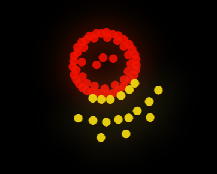
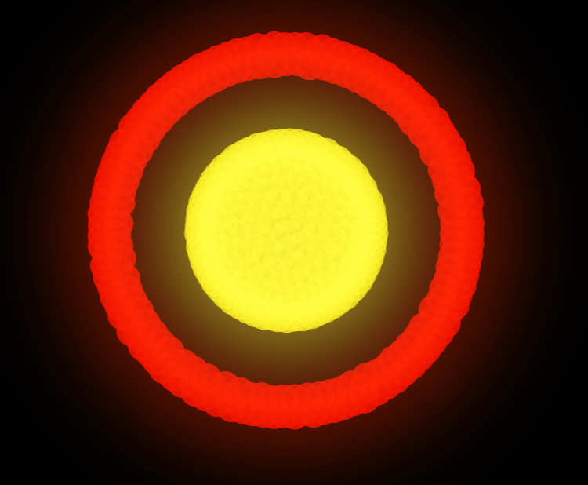
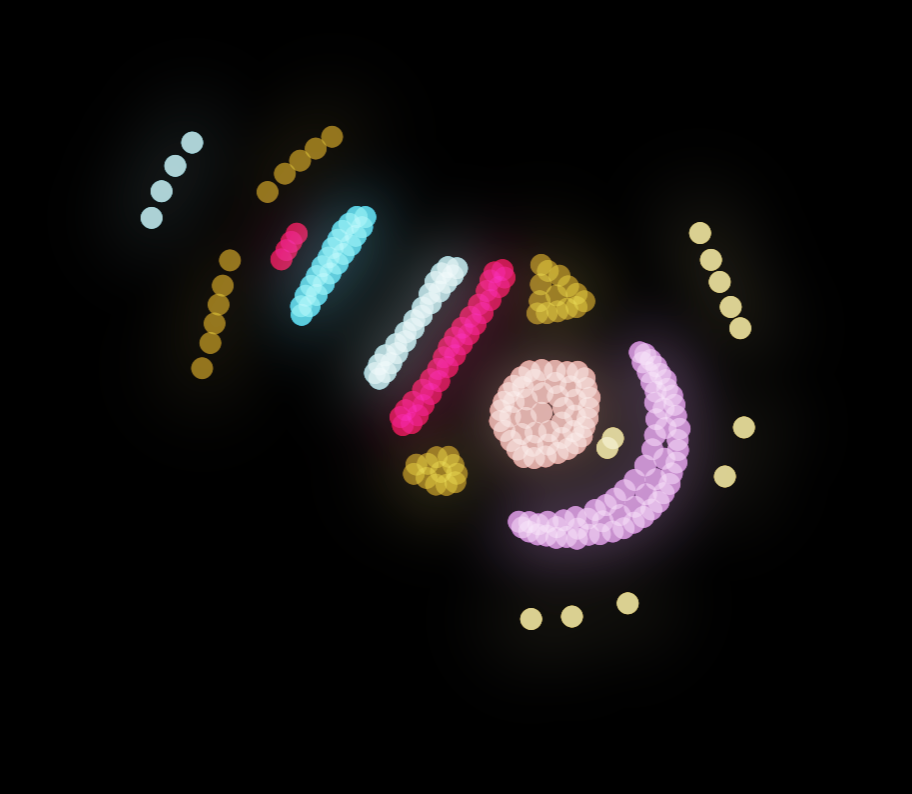
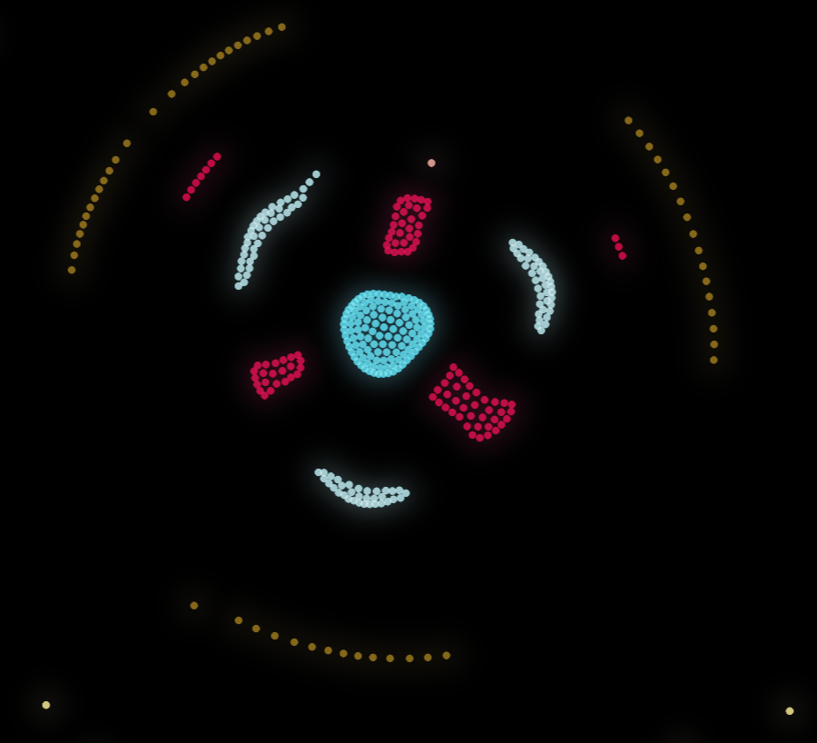

# Introduction

I've seen a fair bit of discussion on how to categorize creatures in particle life. A standardized system to do this could be very valuable -- it would allow us to share creatures that each user can replicate with their own software. With some code, we could automatically categorize creatures and find the biodiversity of a given matrix.

This is my approach to a universal classification. It's very flawed and not a good solution (which I'll discuss more later), but I think it's a good first step.

# Sub-creatures Definitions

`s_x` must be satisfied by a species, but `t_x` can be satisfied by a creature, sub-creature, or species.

<!-- 
## `cluster(s_0)`

A group of particles of the same species that clump together.

 -->

## `glider(t_0, t_1)`

A moving group of particles, with `t_1` at the front and `t_0` at the back.

## `cell(t_0, t_1)`

A group of particles enclosed by another group of particles, with `t_1` encapsulating or partially encapsulating `t_0`.

# Creatures

A creature is composed of one or more sub-creatures. The outermost definition of a creature should be a sub-creature function.

## Examples

`glider(WHITE, glider(GREEN, glider(PINK, cell(WHITE, GREEN))))`

# System Limitations

While some creatures work well with this system, others are very ambiguous. Take the following example:

I would classify this as `cell(cell(cell(cell(BLUE, RED), WHITE), RED), BROWN)`. But this isn't the only way: one could switch the order of the red and white so that it the red is the cell wall of `cell(BLUE, WHITE)`. A lot of these problems come from the maximum of two types per sub-creature that this system imposes, but removing this requirement breeds imbiguity. This might be solved by introducing multiple types of cells (maybe different for different axes?), but that ruins the elegant simplicity of this system.

